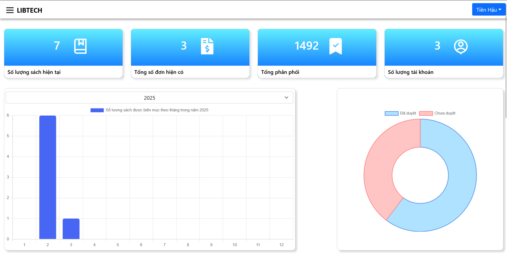
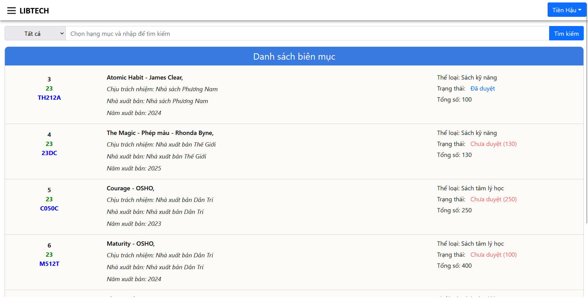
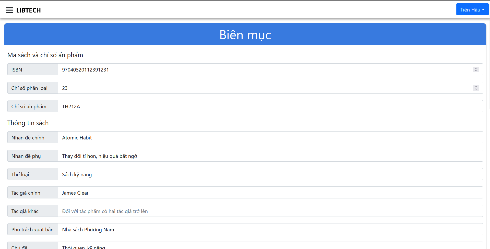
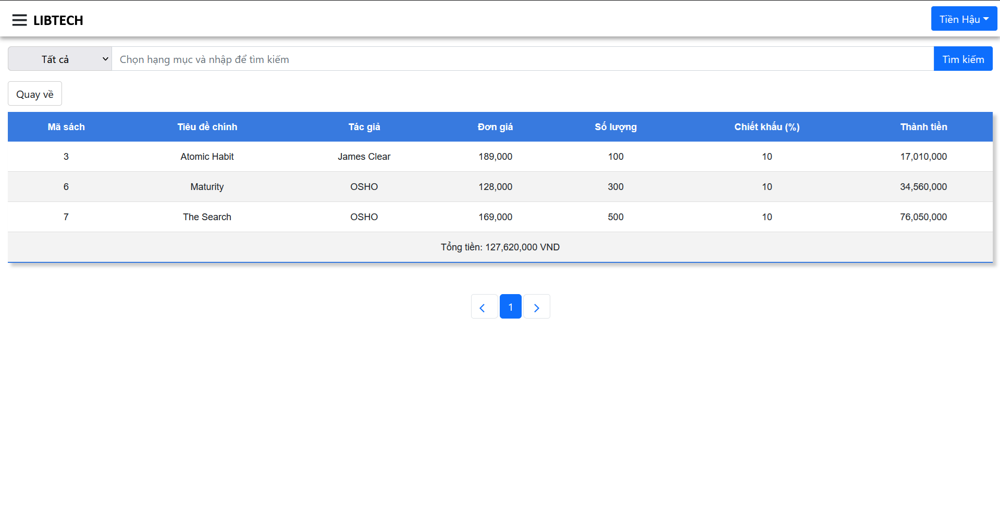
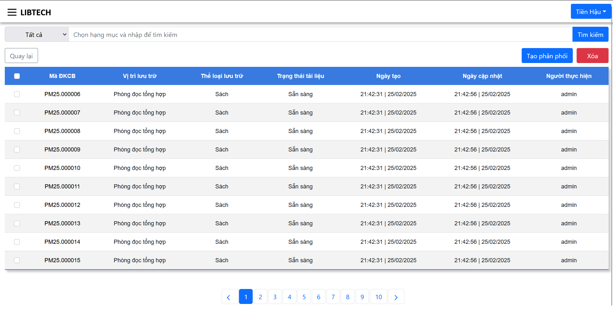
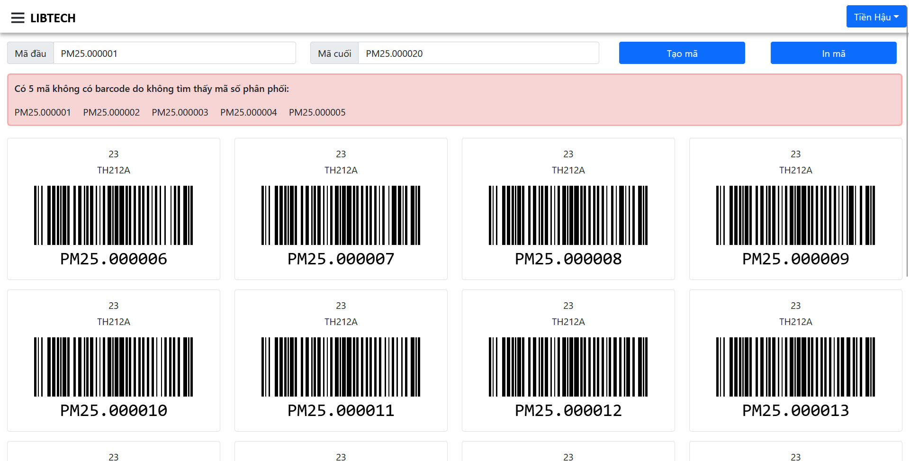
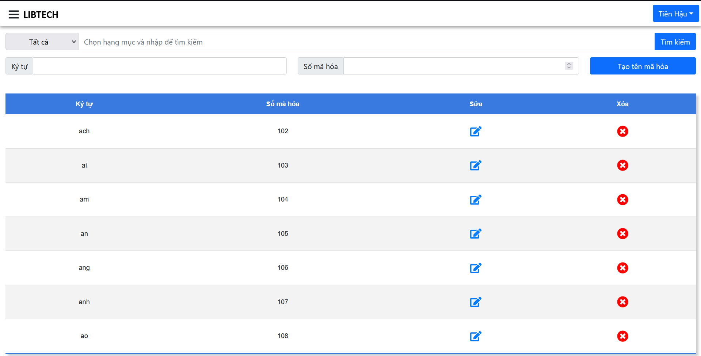

## LibTech - Website quản lý nghiệp vụ tại Thư viện tỉnh Kiên Giang
<b><i>Đề tài thực tập</i></b>
- <b>Người thực hiện: </b> Đặng Nguyễn Tiền Hậu
- <b>Thời gian: </b>03/2024 - 05/2024
-----------------------
### Tổng quan về dự án
- Dự án là một đề tài thực tập hướng tới việc xây dựng một website hỗ trợ công tác quản lý nghiệp vụ sách Thư viện tỉnh Kiên Giang.
- Website kế thừa những chức năng tốt từ website cũ đang được sử dụng tại thư viện, đồng thời sẽ khắc phục và bổ sung thêm những chức năng mới để tăng hiệu quả, hữu ích hơn cho người quản lý.

<h4>Một số hình ảnh của dự án</h4>
<h5>Giao diện Website</h5>

  
  

  
  

  
  
  

-----------------------
### Các tính năng chính
1. Đăng nhập và xác thực với JWT Token.
2. Quản lý một số đối tượng:
    - Quản lý (CRUD) tài khoản.
    - Quản lý (CRUD) đơn sách.
    - Quản lý (CRUD) biên mục sách.
    - Quản lý (CRUD) phân phối sách.
    - Quản lý (CRUD) thông tin phân phối:
        + Phòng
        + Thể loại lưu trữ
        + Trạng thái tài liệu
3. Website cung cấp thêm một số công cụ để hỗ trợ công tác quản lý:
    - Tạo mã barcode-128: Tự động tạo mã barcode-128 dựa trên mã số phân phối sách (VD: PM25.000001) để in ra và dán vào sách, đánh dấu khu vực xếp sách lên kệ.
    - Bảng tên mã hoá sách: Dựa theo 100% bảng tên mã hoá sách hiện hành tại Việt Nam. Nhằm thuận tiện cho cán bộ tra cứu trong quá trình biên mục sách.

-----------------------------------------------
### Kết quả
<b>Ưu diểm: </b>
- Website hoạt động tốt, các chức năng cơ bản và nâng cao đều ổn định.
- Đề tài theo sát với những gì được tiếp xúc trong quá trình thực tập, được giảng viên và cán bộ hướng dẫn đánh giá cao.
- Đánh giá trên thang điểm 10: 9.0

<b>Hạn chế: </b>
- Website chỉ gói gọn trong quy mô tại phòng nghiệp vụ, chưa liên kết đến các phòng khác.
- Các chức năng vẫn còn lỗi nhỏ.

-----------------------------------------------
### Liên Hệ
Nếu bạn có bất kỳ câu hỏi nào hoặc muốn đóng góp cho dự án, hãy liên hệ với tôi qua:

- Email: [tienhau.it@gmail.com](mailto:tienhau.it@gmail.com)
- GitHub: [Thomas Dang](https://github.com/HauDNT)
- LinkedIn: [Hau Dang](https://www.linkedin.com/in/haudnt/)